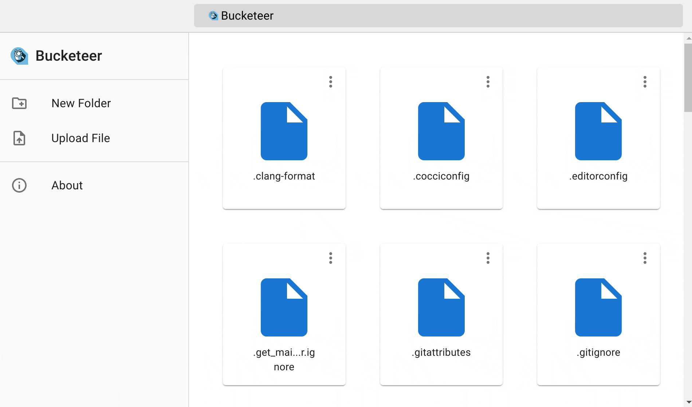

# Bucketeer


*Browsing a [Cloudflare R2](https://www.cloudflare.com/developer-platform/r2/) bucket containg the Linux kernel source tree.*

## Getting Started

Assuming you have the [AWS CLI](https://aws.amazon.com/cli/) installed and configured.

```shell
bucketeer my-bucket
```

## Features

* Easy to use Web UI.
* Run locally or as a container.
* Upload/download files (without limits).
* Large directory support.

## License

Bucketeer is dual licensed under the [AGPLv3](./LICENSE) and a commercial license.

The commercial distribution includes additional features such as authentication/authorization, audit logging, and includes an accompanying Kubernetes operator to make deploying Bucketeer a breeze.

If you'd like to use the commercial distribution please reach out to me via [Email](mailto:damian@pecke.tt). Don't worry, its not going to cost you an arm and a leg. All sales go a long way to helping keep Bucketeer awesome.